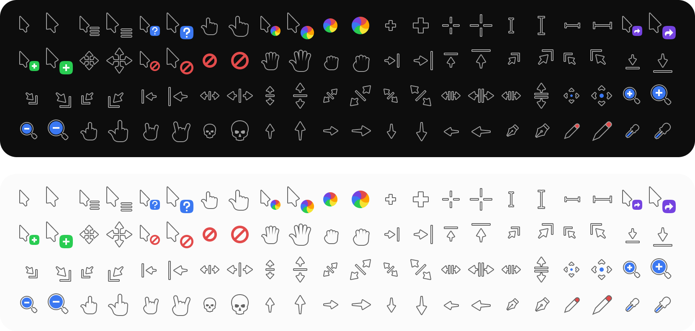
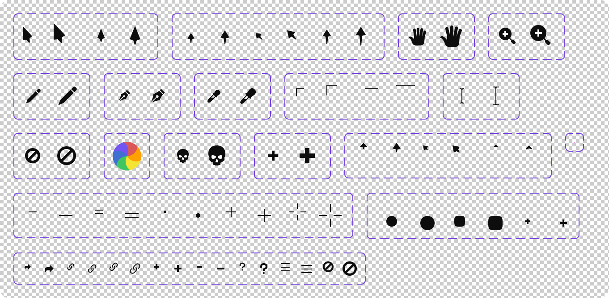

# Phinger Cursors

Say hello to your new cursor theme. Phinger Cursors is most likely the most over engineered cursor theme out there.



## How to install

### Arch Linux

I'm maintaining [phinger-cursors](https://aur.archlinux.org/packages/phinger-cursors) in the Arch User Repository. You can install it with your favorite AUR helper:

```sh
paru -S phinger-cursors
```

> [!NOTE]
> Please let me know if you want to maintain this package in the official Arch Linux repositories, so that I can update the instructions here.

### Ubuntu

Install the `phinnger-cursor-theme` from the Ubuntu repositories (thanks to @eeickmeyer):

```sh
apt-get update
apt-get install phinger-cursor-theme
```

### NixOS

You can install the `phinger-cursors` package (thanks to @moni-dz) from the NixOS repositories by adding it to your `configuration.nix`:

```nix
environment.systemPackages = with pkgs; [
  phinger-cursors
];
```

Or use it in your home-manager configuration:

```nix
home.pointerCursor = {
  name = "phinger-cursors-light";
  package = pkgs.phinger-cursors;
  size = 32;
  gtk.enable = true;
};
```

### Manually

For a manual installation, download and extract the [latest release](https://github.com/phisch/phinger-cursors/releases/latest/download/phinger-cursors-variants.tar.bz2) into the `~/.local/share/icons` directory.

```sh
wget -cO- https://github.com/phisch/phinger-cursors/releases/latest/download/phinger-cursors-variants.tar.bz2 | tar xfj - -C ~/.local/share/icons
```

This installs the cursor theme for your current user. To install for all users, extract into `/usr/share/icons` instead.

## How to enable

You might have a settings application installed that can do this for you like [Gnome Tweaks](https://gitlab.gnome.org/GNOME/gnome-tweaks) or [lxappearance](https://wiki.lxde.org/en/LXAppearance). If you don't, enable the cursor theme as described below.

### Manually

Enable your prefered variant `phinger-cursors-dark`, `phinger-cursors-light` or their left-handed counterparts `phinger-cursors-dark-left` or `phinger-cursors-light-left` inside `~/.icons/default/index.theme`:

```ini
[Icon Theme]
Name=Default
Comment=Default Cursor Theme
Inherits=phinger-cursors-light
```

And finally, enable it for GTK applications in your `~/.config/gtk-3.0/settings.ini`:

```ini
[Settings]
gtk-cursor-theme-name=phinger-cursors-light
```

## How to change cursor size

The available cursor sizes are `24`, `32`, `48`, `64`, `96` and `128`. How to change it depends on your current environment.

### GNOME, MATE, XFCE

Run the following command and replace `CURSOR_SIZE` with your prefered one:

- on GNOME: `gsettings set org.gnome.desktop.interface cursor-size CURSOR_SIZE`
- on MATE: `gsettings set org.mate.peripherals-mouse CURSOR_SIZE`
- on XFCE: `xfconf-query --channel xsettings --property /Gtk/CursorThemeSize --set CURSOR_SIZE`

### Xresources

Add this line to your `~/.Xresources` and replace `CURSOR_SIZE` with your prefered one:

```sh
Xcursor.size: CURSOR_SIZE
```

## How it's made

Phinger Cursors are designed in a [Figma](https://www.figma.com) document. Check out the [multi-page Figma document](https://www.figma.com/file/zU99op23bu3Cg438YkhZy8/phinger-cursors) used by this repository.

You can find an up to date copy of that document in this repositories root directory at [phinger-cursors.fig](phinger-cursors.fig).

### Parts

Every cursor sprite is assembled from core parts. Changing one of those parts, will change every cursor sprite that uses it.



Each part is designed on a base grid of 24 and 32:


which means will be pixel perfect for any reasonable size:

|             24              |             32              |             48              |             64              |             72              |             96              |              128              |
| :-------------------------: | :-------------------------: | :-------------------------: | :-------------------------: | :-------------------------: | :-------------------------: | :---------------------------: |
|  |  |  |  |  |  |  |

If possible, parts are designed very modular, which lets you create multiple different icons from one part. A good example is the hand part that comes with multiple variations for each single phinger:


### Sprites

The parts are assembled, and styled into sprites. Those sprites are named and contain metadata necessary to generate a cursor theme from them.

Each cursor contains information about which cursor and variant it belongs to, what its cursors aliases should be, how to transform it into a left-handed cursor, a hotspot element and instructions on how it should be animated.

### Build process

Phinger Cursors are built using my [Cursor Theme Builder](https://github.com/phisch/cursor-theme-builder). It provides a JSON schema to describe a cursor theme, an exporter, that can create such a JSON file and assets from a Figma file, and a builder, which makes fully functioning X11 cursor theme variants from that. It also allows to transform cursors into left-handed versions, comes with an animation system and more.

This repository contains [workflows](.github/workflows) to extract a cursor-theme.json and assets, and drafts a release with built cursor theme variants.

## License & Credits
All assets, including the Figma document are licensed under the [CC-BY-SA-4.0 License](LICENSE).

Although designed from scratch, Phinger Cursors drew inspiration from [capitaine-cursors](https://github.com/keeferrourke/capitaine-cursors), which is based on the KDE Breeze cursors. So this is a special thanks to them, and all other amazing cursor themes out there!

## Contribute

If you notice any issues like missing cursors or symlinks, something doesn't look quite right to you, or you have suggestions for better designs or new cursors, please open an issue and let me know about it.

I can't let people contribute to the Figma document directly, but I will listen to constructive feedback through GitHub issues.

### Desktop Makers

<a href="https://discord.gg/RqKTeA4uxW" title="Desktop Makers Discord"></a>

I am actively working on Phinger Cursors and other cool projects on the [Desktop Makers Discord](https://discord.gg/RqKTeA4uxW). It aims to be a community for communities of Linux desktop related projects. If you are looking to collaborate with or want to contribute to great projects, this might be the right place for you.
